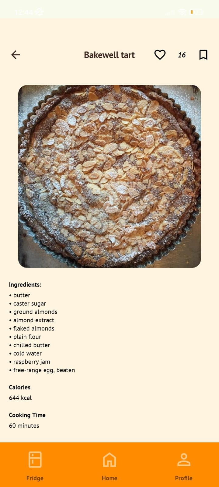

# Android

This is the android side of the _Fridgify_ app.

Here are the screenshots of our Android app.

### Login Screen: 

### Home Screen and Filter Choices

  
  

The home screen displays the recipes according the user's fridge, also users can filter the recipes as their choices.

### Recipe Detail Screen

Users can see the details of recipes, like save or comment to them.

### Fridge Screens

  
  

Users can add food to their fridge or delete foods. Foods can be filtered according to categories.

### Profile Screens

  
  

Users can see their own recipes, edit or delete them. Also they can see the saved or liked recipes. 